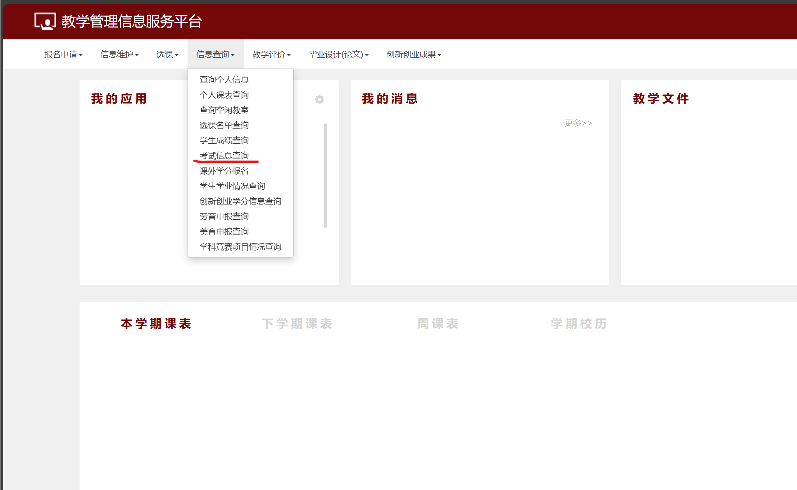
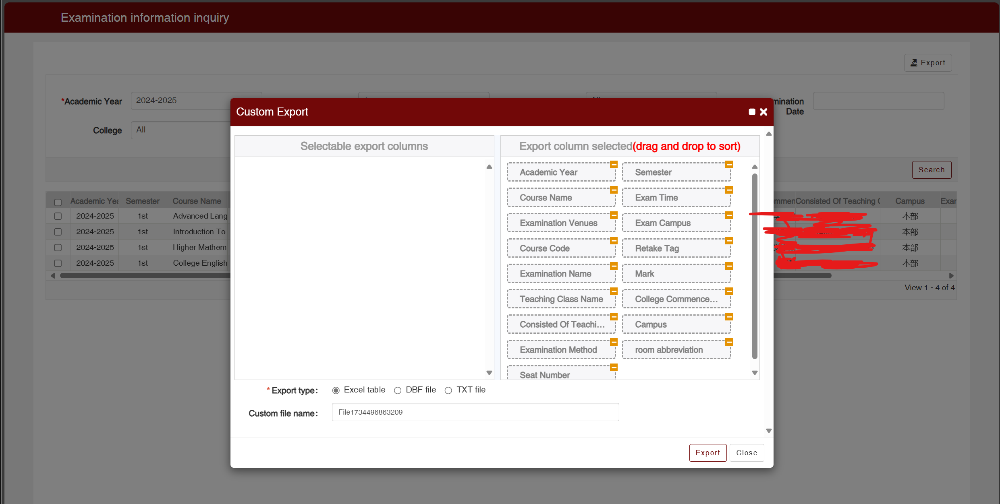

# Calendar_for_importing the Final Exam

### Get the Final Exam schedule from your Teaching integrated information service platform, then create ics file for inputting to your mobile phone.

#### What's Function?

- Match the campus place (for Huzhou University/Huzhou College,but you can replace it by change the JSON file on <code>/modules</code>)
- Select the Final Exam date,classroom,place,and more
- Alarm you before 1 hour

#### How to start?

To input the final exam data and create the ICS file,you should download the exam schedule file in excel fitst.

The steps for Zhengfang System are following:

<ol>
    <li> Come to your teaching system,and go to your exam schedule list:</li>
     
    <li> Click the "考试信息查询"in Chinese,or"Examination information inquiry"in English:</li>
    </img>
    <li> Click "导出"/"Export"，then choose"Excel table"</li>
    </img>
    <li> Download the repository to your computer,and Uncompress all the files if you download it directly.</li>
    <li> Make sure you have Python 3.12 or later,then run the command on the repository folder:<code>pip install -r requirements.txt</code></li>
    <li> Run main.py,and input the Excel you have got on step3.</li>
    <li> You will got a ICS file on the folder <code>result</code> where the main program is.</li>
    <li> Input the ICS file to your calendar apps.
</ol>

### The application is still filling.
